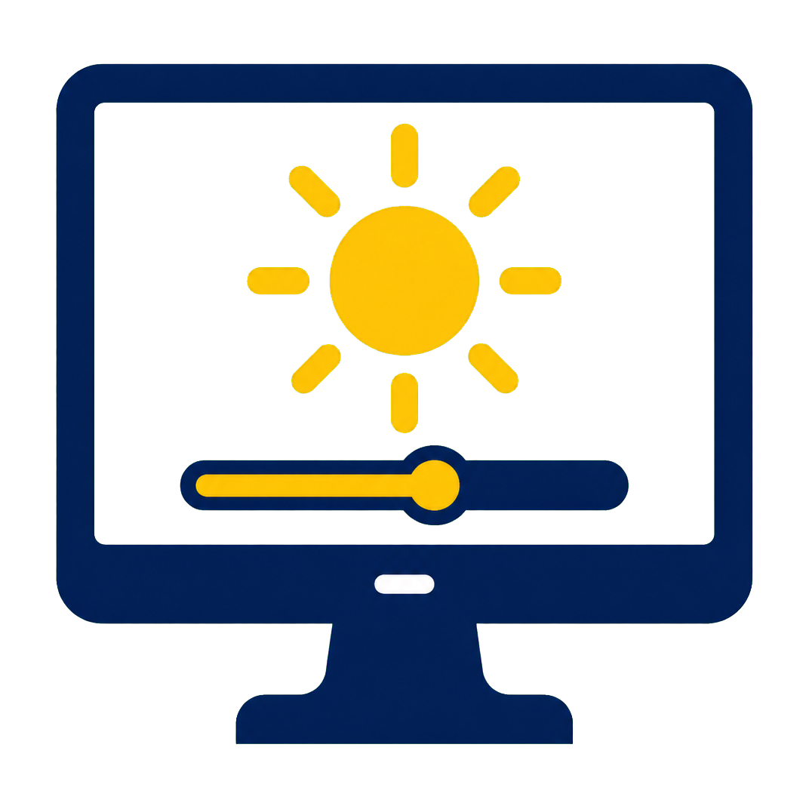

# ExtLume — External monitor brightness for Windows

[](https://github.com/gronbow/extlume/actions/workflows/ci.yml)



[简体中文](README.zh-CN.md)

> The first public release is a beta.

A small Windows tray app for the common case where Windows shows a brightness
slider only for the laptop panel and the external monitor's buttons or OSD
cannot be used.

The app detects active external displays, shows their EDID model names, and
provides a separate slider for each safely identifiable display.

## What it does

- Identifies active external monitor models through Windows DisplayConfig and
  EDID metadata.
- Excludes built-in panels and virtual displays from control.
- Prefers real hardware backlight control through DDC/CI.
- Uses the high-level Windows monitor-brightness API first, then the standard
  brightness VCP code `0x10`.
- Falls back to a click-through software-dimming overlay when hardware control
  is unavailable and Windows exposes a safely isolated external desktop area.
- Handles multiple displays, mirrored display groups, hot-plugging, and resume.
- Runs in the system tray and can start with Windows.
- Uses Chinese or English automatically.
- Requires no administrator rights and makes no network connections.

## Two control modes

| Mode | What changes | Requirement |
|---|---|---|
| Hardware · DDC/CI | The monitor's physical backlight | The monitor and the complete cable/dock chain must expose DDC/CI brightness control |
| Software dimming | The visible desktop image on that external display | An active, safely identified external display that does not share its desktop source with the built-in panel |

Software dimming does **not** reduce panel backlight power. The UI labels this
mode explicitly so it is never confused with hardware brightness.

In Windows Duplicate mode, hardware DDC/CI remains available when supported.
If the external display shares its desktop source with the built-in panel and
DDC/CI is unavailable, the app blocks the software overlay and asks the user to
switch to Extend. This prevents the built-in display from being dimmed.

## Install

For a release build:

1. Download either the per-user installer or portable ZIP from GitHub Releases.
2. Verify the SHA-256 checksum in `SHA256SUMS.txt`.
3. Run `ExtLume.exe`.

The app targets Windows 10 and Windows 11 with .NET Framework 4.8. The installer
uses the current user's profile and does not request elevation.

## Compatibility notes

Hardware control can be blocked by the monitor, GPU driver, cable, adapter, KVM,
or dock. Some monitors require DDC/CI to be enabled in their OSD. A monitor may
also advertise DDC/CI but implement the standard incompletely.

The app therefore exposes only brightness control. It does not accept arbitrary
VCP codes, perform monitor resets, or silently choose another display when the
selected display disappears.

See [Compatibility and troubleshooting](docs/COMPATIBILITY.md).

## Privacy

There is no telemetry, analytics, update check, account, cloud service, or
network request. The app stores only:

- a hashed local monitor identifier and its software-dimming percentage; and
- the executable path if the user enables “Start with Windows”.

Raw monitor serials and device paths are not logged. See [PRIVACY.md](PRIVACY.md).

## Build and test

The project has no NuGet or third-party runtime dependencies.

```bat
build.cmd
test.cmd
probe.cmd
```

`build.cmd` uses the .NET Framework compiler included with Windows. Visual Studio
2022 users can also open `ExtLume.sln` with the .NET Framework
4.8 targeting pack installed.

The read-only probe prints model names and display classes but never writes a
brightness value.

The UI follows the Windows language. `--language=en` or `--language=zh-CN` can
be used for a temporary language override.

See the [v0.2.0-beta.1 validation report](docs/VALIDATION_REPORT_v0.2.0-beta.1.md)
for automated, live-discovery, real-hardware, and beta-matrix results.

## Contributing and security

Read [CONTRIBUTING.md](CONTRIBUTING.md), [SECURITY.md](SECURITY.md), and
[SUPPORT.md](SUPPORT.md) before opening a report.

## License

[MIT](LICENSE)
