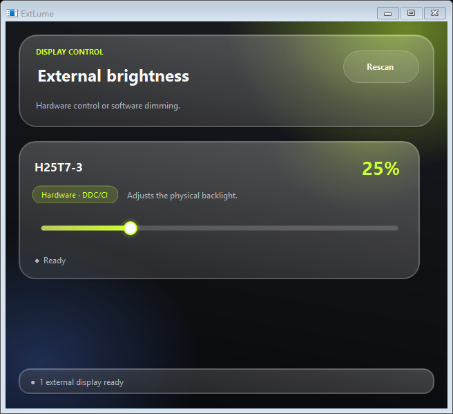

# ExtLume — Windows 外接显示器亮度工具

[](https://github.com/gronbow/extlume/actions/workflows/ci.yml)


[English](README.md)

> 当前公开版本仍为 Beta 测试版。

这是一个轻量的 Windows 托盘应用，解决以下常见问题：Windows 只为笔记本内置屏提供亮度滑块，而外接显示器的实体按键或 OSD 菜单又无法使用。

应用会自动识别当前外接显示器的 EDID 型号，并为每台能够安全定位的外接屏提供独立亮度滑块。



## 主要功能

- 通过 Windows DisplayConfig 和 EDID 元数据识别外接显示器型号；
- 内置屏与虚拟显示器不会进入控制列表；
- 优先通过 DDC/CI 调节显示器真实背光；
- 先尝试 Windows 高级亮度接口，再回退到标准亮度 VCP `0x10`；
- 硬件调光不可用、且 Windows 提供可安全隔离的外接桌面区域时，回退为软件调暗遮罩；
- 支持多显示器、复制显示分组、热插拔和睡眠恢复；
- 支持系统托盘与开机启动；
- 根据系统语言自动显示中文或英文；
- 使用适配高 DPI 的毛玻璃界面，并支持鼠标、滚轮和键盘调节；
- 无需管理员权限，无网络请求。

## 两种控制模式

| 模式 | 实际改变 | 使用条件 |
|---|---|---|
| 硬件背光 · DDC/CI | 显示器物理背光 | 显示器及完整线缆/扩展坞链路必须支持并透传 DDC/CI 亮度控制 |
| 软件调暗 | 该外接屏上的桌面画面 | Windows 已激活、应用能够安全识别，且不与内置屏共用桌面源 |

软件调暗**不会**降低面板背光功耗。界面会明确标注当前模式，不会把软件遮罩冒充成硬件亮度。

Windows“复制”模式下，只要链路支持，硬件 DDC/CI 仍可使用。若外接屏与内置屏共用桌面源且 DDC/CI 不可用，应用会阻止软件遮罩并提示切换到“扩展”，从而避免调暗内置屏。

## 安装

正式发布后：

1. 从 GitHub Releases 下载当前用户安装包或便携 ZIP；
2. 使用 `SHA256SUMS.txt` 校验 SHA-256；
3. 运行 `ExtLume.exe`。

应用面向 Windows 10 与 Windows 11，使用 .NET Framework 4.8。安装包写入当前用户目录，不请求管理员权限。

## 兼容性说明

显示器、显卡驱动、线缆、转接器、KVM 或扩展坞都可能阻断硬件 DDC/CI。有些显示器还要求先在 OSD 中启用 DDC/CI，也有显示器会声明支持协议却未完整实现。

因此，本应用只开放亮度控制，不接受任意 VCP 代码，不执行显示器重置；目标显示器消失时，也不会静默改调另一台显示器。

详见[兼容性与故障排查](docs/COMPATIBILITY.zh-CN.md)。

## 隐私

本应用没有遥测、分析、更新检查、账号、云服务或网络请求。它只在本机保存：

- 外接屏标识的哈希值与软件调暗百分比；
- 用户启用“开机启动”时的程序路径。

原始显示器序列号和设备路径不会写入日志。详见 [PRIVACY.md](PRIVACY.md)。

## 构建与测试

项目没有 NuGet 或第三方运行时依赖。

```bat
build.cmd
test.cmd
probe.cmd
```

`build.cmd` 使用 Windows 自带的 .NET Framework 编译器。安装了 .NET Framework 4.8 Targeting Pack 的 Visual Studio 2022 也可直接打开 `ExtLume.sln`。

只读探针只输出显示器型号和分类，绝不会写入亮度值。

界面默认跟随 Windows 语言，也可用 `--language=en` 或 `--language=zh-CN` 临时指定。

自动化、实时识别、真机写入和 Beta 硬件矩阵结果见
[v0.3.0-beta.1 验证报告](docs/VALIDATION_REPORT_v0.3.0-beta.1.md)。

## 贡献与安全

提交问题前，请阅读 [CONTRIBUTING.md](CONTRIBUTING.md)、[SECURITY.md](SECURITY.md) 和 [SUPPORT.md](SUPPORT.md)。

## 许可证

[MIT](LICENSE)
